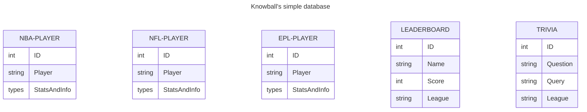

Our database doesn't require relational logic. Each of the three leagues represented - NBA, NFL, and EPL - are playable as separate game modes.
In other words, they don't interact. Within in any league, all data needed to compute obscurity is in the corresponding "PLAYERS" table. This
league can be inferred from the game mode when writing to the leaderboard.

