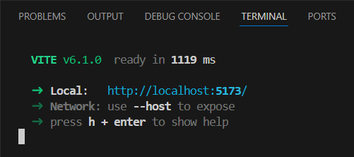
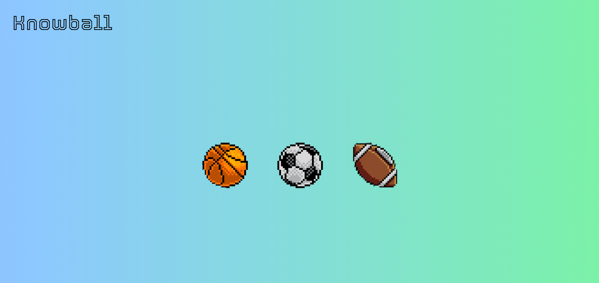
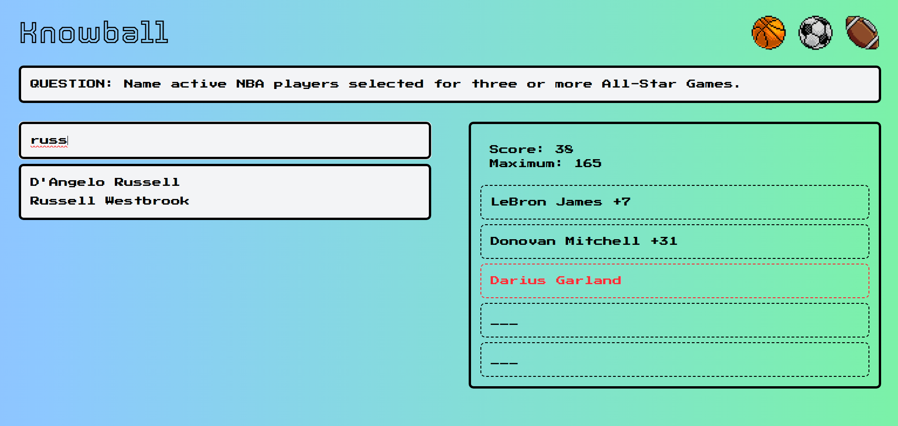
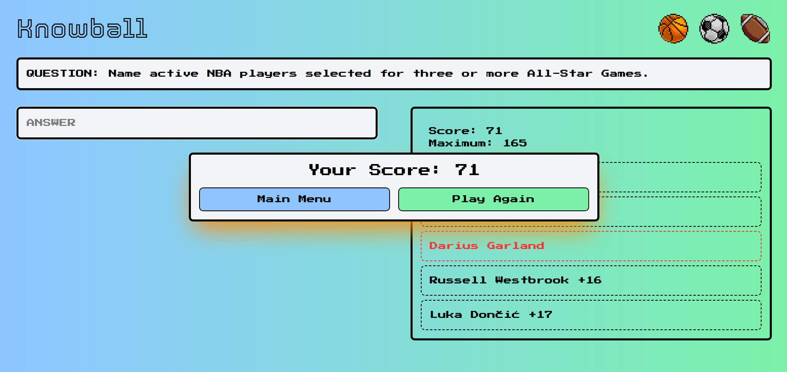

# Knowball User Manual

***Follow the simple guide below to run and play Knowball.***

## Get Up & Running

Knowball isn’t hosted online. To run it, you must first clone this repository. Do so however you prefer, then see the following steps.

1.	Open a terminal to the ***frontend*** directory.
2.	Run the command below.

```
npm run dev
```

3.	You should see something like this.



4.	Click the link to run Knowball in your browser.

## Gameplay Instructions

Gameplay begins on the main menu. Choose a game mode (basketball, soccer, or football) by clicking on the corresponding icon.



For this example, I chose basketball. After a brief loading period, trivia will be pushed to the screen. Then, all you need to do is answer
it with the names of five athletes; the more obscure they are, the more points you’ll get. To answer, begin typing in the input box. The dropdown
menu is dynamically filtered as you go. You can 1) press the enter key to submit the first name in the list or 2) scroll down and click on the
name you’re looking for. The following are further notes on the interface.

- You can load a new question by refreshing the page.
- You can switch game modes by clicking the icons in the top-right corner of the page.
- Incorrect answers are highlighted in red.
- Duplicate answers are blocked.
- “Maximum” displays the best possible score for the question.



After submitting five answers, you’ll receive a pop-up with your score and two options: return to the main menu or try the game mode again. The choice is
yours!



## FAQ

#### Why can’t I guess athletes who have retired?

> Data availability issues dictated that we restrict the dataset to only active players.

#### How is obscurity calculated?

> The scores are computed by our Obscurity Engine, an ML model that considers athletes’ career statistics and social following. For more information, see
> [our poster](https://github.com/BlairBowen/Knowball/blob/main/presentations/knowball-poster.pdf).
